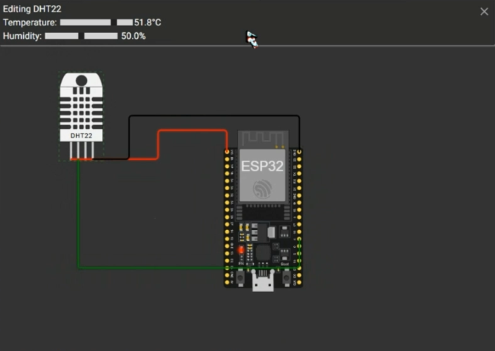

# Passa a Bola — Monitor de Temperatura & Umidade
**ESP32 + DHT22 + FIWARE (IoT Agent MQTT)**

Projeto da equipe **Zetta Works** para ajudar as atletas a encontrarem o **campo na melhor condição**.  
Medimos **temperatura** e **umidade** com **ESP32 + DHT22**, publicamos por **MQTT** e atualizamos uma entidade no **FIWARE**.  

---

##  Objetivo
Expor **apenas os valores atuais** `temperature` (°C) e `humidity` (%) para uso em site/app.

---

##  Visão rápida
- **ESP32 + DHT22** (DATA → **GPIO 4**, VCC → **3V3**, GND → **GND**)
- **MQTT Topics (UL 2.0 – payload numérico):**
  - `/TEF/field001/attrs/t` → `26.4`
  - `/TEF/field001/attrs/h` → `68.2`
- **Entidade Orion:**
  - `id = urn:ngsi-ld:Field:field001`
  - `type = SoccerField`
  - atributos: `temperature` (Number), `humidity` (Number)

---

## Arquitetura (resumo)
Dispositivo (ESP32/DHT22) → MQTT → **IoT Agent MQTT** (porta **4041**) → **Orion** (porta **1026**).  

---

## Pré-requisitos
- FIWARE rodando (IoT Agent, Orion; opcional STH-Comet)
- Postman com a coleção **DHT FIWARE**
- Wokwi/Arduino IDE/PlatformIO com as libs: `PubSubClient`, `DHT sensor library`, `Adafruit Unified Sensor`

---

### IOT Agent MQTT
1. **1.1 Health Check**  
   `GET http://{{url}}:4041/iot/about` — verifica o agente.

2. **2. Provisioning a Service Group for MQTT** 
   Envia `apikey: TEF`, `entity_type: SoccerField`, `resource: ""`.  
   URL: `POST http://{{url}}:4041/iot/services`.

3. **2.1 Health Check Services**  
   `GET http://{{url}}:4041/iot/services` — confirma o service group.

4. **3. Provisioning a DHT** 
   Cria o device `field001` (URN + atributos `t` e `h`).  
   URL: `POST http://{{url}}:4041/iot/devices`.

5. **5. List all Devices Provisioned**  
   `GET http://{{url}}:4041/iot/devices` — deve listar `field001`.

---

## Firmware (Wokwi/real)

- Configure no código:
  - `MQTT_HOST` = IP do IoT Agent
  - `APIKEY = "TEF"`
  - `DEVICEID = "field001"`
  - Wi-Fi Wokwi: `Wokwi-GUEST` (sem senha)

Publica somente:
- `"/TEF/field001/attrs/t"` (temperatura)
- `"/TEF/field001/attrs/h"` (umidade)

Assim que publicar pela primeira vez, a entidade NGSI é criada/atualizada no Orion.

Após isso é só dar Request Temperature/humidity que você vai obter os valores atuais.
